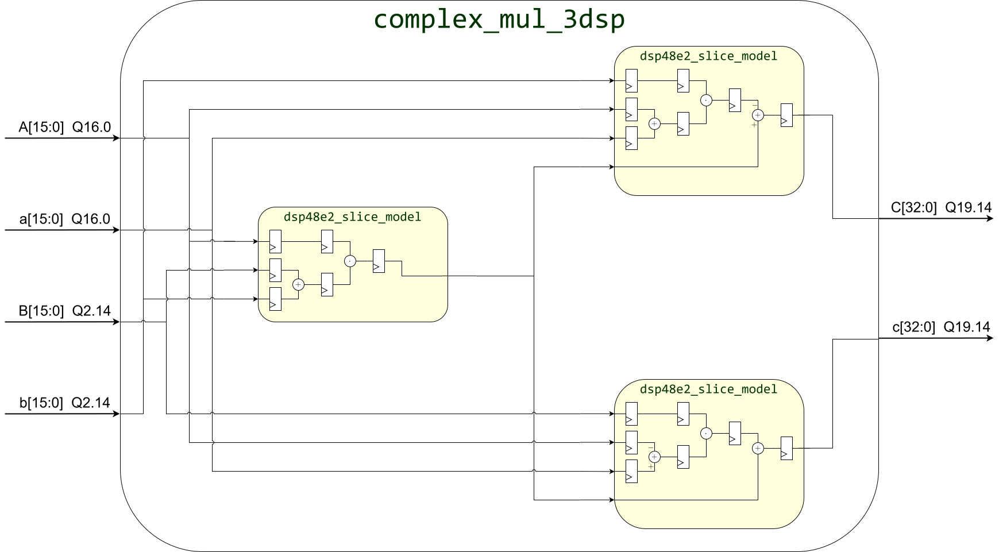
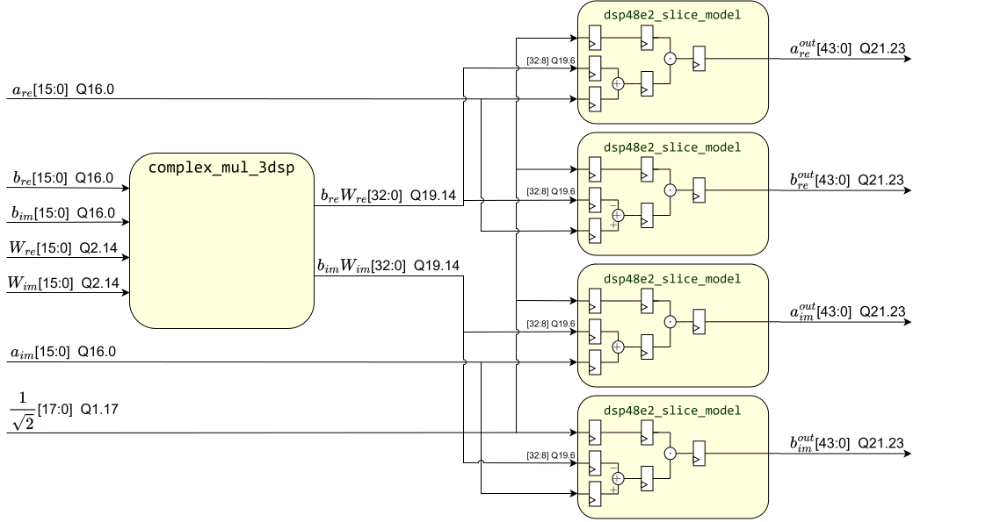
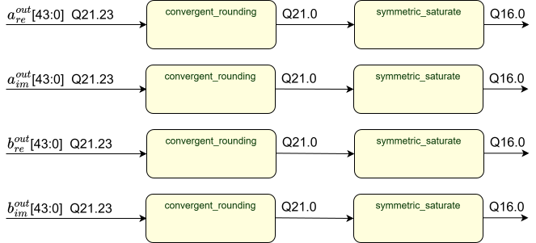
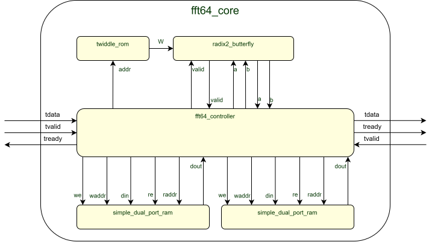

<p align="center">


</p>

# 64-точечное преобразование Фурье на базе Radix-2

Учебный HDL-проект школы синтеза YADRO: разработка FFT64-ядра на SystemVerilog на базе одного переиспользуемого radix-2 butterfly-блока.

Ядро принимает поток комплексных отсчетов, выполняет 64-точечное быстрое преобразование Фурье и выдает результат через AXI Stream интерфейс `tdata/tvalid/tready`.

## Структура

- `rtl/` — синтезируемый SystemVerilog RTL.
- `model/` — C reference/fixed модели, генераторы входов и compare-утилиты.
- `testbenchs/` — SystemVerilog testbench, DPI-C связка и Makefile для симуляций.
- `constraints/` — XDC constraints для синтеза.
- `report/` — презентация проекта и исходники схем.
- `Vivado/` — локальный Vivado-проект и артефакты запусков.

## Цель

Цель проекта — разработать, промоделировать и проверить radix-2 butterfly, а затем собрать на его основе полное 64-точечное FFT-ядро.

FFT построен по radix-2 decimation-in-time схеме: входной кадр проходит последовательность стадий с butterfly-операциями и twiddle-коэффициентами. Вычислительная часть сделана time-multiplexed: один radix-2 butterfly-блок переиспользуется во времени для всех пар отсчетов, а обходом стадий управляет `fft64_controller`.

## Комплексный умножитель

`complex_mul_3dsp` реализует умножение комплексных чисел через три DSP48E2-подобных блока вместо четырех отдельных умножителей. В проекте используется модель `dsp48e2_slice_model`, повторяющая нужные для проекта pre-adder, multiplier и post-adder режимы DSP48E2.



## Radix-2 Butterfly

`radix2_butterfly` выполняет базовую операцию FFT:

```text
a_out = (a + bW) / sqrt(2)
b_out = (a - bW) / sqrt(2)
```

Внутри блока `b` умножается на twiddle-коэффициент `W` через `complex_mul_3dsp`, затем четыре DSP48E2-подобных блока считают суммы/разности и масштабируют результат на `1/sqrt(2)`. После этого выполняются convergent rounding и symmetric saturate, чтобы вернуть результат в выходной фиксированный формат.





## FFT64 Core

`fft64_core` объединяет управляющую логику и вычислительный datapath 64-точечного FFT:

- `fft64_controller` — прием входного кадра, обход стадий FFT, адресация банков памяти, выдача результата.
- `twiddle_rom` — ROM twiddle-коэффициентов `W_N^k`.
- `radix2_butterfly` — переиспользуемый вычислительный блок одной butterfly-операции.
- `simple_dual_port_ram` — два RAM-bank для хранения промежуточных результатов.



## Модели и тесты

В `model/` лежат C-модели и утилиты проверки:

- `complex_mul_3dsp/` — модель комплексного умножителя.
- `dsp48e2_slice_model/` — модель DSP48E2-подобного слайса.
- `radix2_butterfly/` — fixed/reference модели butterfly и сравнение по SQNR.
- `fft64_core/` — reference/fixed модели FFT64, генератор white-noise входов и compare-утилиты.

В `testbenchs/` лежат RTL-тесты. Часть тестов использует DPI-C: SystemVerilog testbench вызывает C-модель и сравнивает результат RTL с программным эталоном. Для FFT64 проверка строится на backoff-controlled white noise и метрике SQNR. Reference-модель FFT64 можно дополнительно сверить с FFTW3, если в WSL установлен `libfftw3-dev`.

## Результаты синтеза

Синтез из отчета выполнен для `xcku025-ffva1156-2-e` с ограничением:

```tcl
create_clock -period 4.000 -name clock -waveform {0.000 2.000} [get_ports clk]
```

Итоговая частота: `Fmax = 303 МГц`.

| Resource | Utilization |
| --- | ---: |
| LUT | 592 |
| FF | 551 |
| BRAM | 1 |
| DSP | 7 |
| IO | 70 |
| BUFG | 1 |

## Запуск

Сборку моделей и RTL-тесты нужно запускать из WSL или Linux-окружения с установленными зависимостями.

Минимальные зависимости:

```bash
sudo apt update
sudo apt install -y build-essential make gcc python3 iverilog verilator
```

Опциональные зависимости:

```bash
sudo apt install -y libfftw3-dev python3-pip
python3 -m pip install -r model/radix2_butterfly/tools/requirements.txt
```

`libfftw3-dev` нужен только для сверки reference-модели FFT64 с FFTW3. Python-пакеты нужны для построения SQNR/backoff-графиков.

Основные команды для C-моделей:

```bash
make -C model list-models
make -C model run-radix2_butterfly_compare
make -C model run-fft64_core_fixed_compare
```

Основные команды для RTL-тестов:

```bash
make -C testbenchs run-radix2_butterfly
make -C testbenchs run-fft64_core
make -C testbenchs run-all
```
